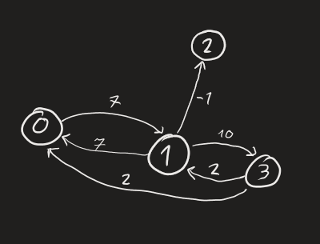

# Projekt-Grafy

**Projekt zaliczeniowy na zajęcia z Teorii Grafów.**

## Struktura projektu

Folder **Algorithm** zawiera implementację struktury grafu oraz algorytmu Bellmana-Forda w jezyku Python.
W **Analysis** znajduję się rozwiązanie części teoretycznej - zadania 1-8 oraz analiza algorytmu.

## Uruchamianie programu
**Wymagania**  
Zainstalowany Python 3.1 lub nowszy.

**Uruchamianie**  
Uruchamiamy plik "main.py" w folderze Algorithm, każde środowisko powinno dać radę, można też użyć wiersza poleceń, będą w folderze **Algorithm** uruchamiamy polecenie:  
>python3 main.py

**Dane wejściowe**  
Podajemy względną ścieżkę do pliku w którym zapisana jest reprezentacja grafu, dla przykładowego grafu w folderze Algorithm będzie to wyglądać tak:  
> exampleGraph1.json  

Dla przykładowego grafu w folderze Data:
> ../Data/exampleGraph2.json  

Następnie enter i wpisujemy numer wierzchołka z którego algorytm ma rozpocząć działanie.

**Dane wyjścione**  
Program wypisuje słownik, w którym klucze są indeksami wierzchołków, a wartości są minimalnymi odległościami z wierzchołka początkowego.

## Budowa pliku z grafem  
Plik (typu .json lub .txt) ma zawierać listę sąsiedztwa wzbogaconą o wagę krawędzi:  
"2":"-4"  -> oznacza krawędź do wierzchołka 2 o wadze -4  
Krawędzie wychodzące z jednego wierzchołka (z wagami) łączymy w słownik:   
{ "2":"-4", "3":"99"} -> dwie krawędzie wychodzące  
A słowniki łączymy w tablicę: [dict1, dict2, dict3]  

Wierzchołki oznaczamy kolejnymi liczbami nieujemnymi  
Wagi oznaczamy liczbami całkowitymi  

Najlepiej obrazuje to przykład, z danych:
>[{"1": "7"},       
>{"0": "7", "2": "-1", "3": 10},  
>{},  
>{"0": "2", "1": "2"}]  

Powstaje graf:  

